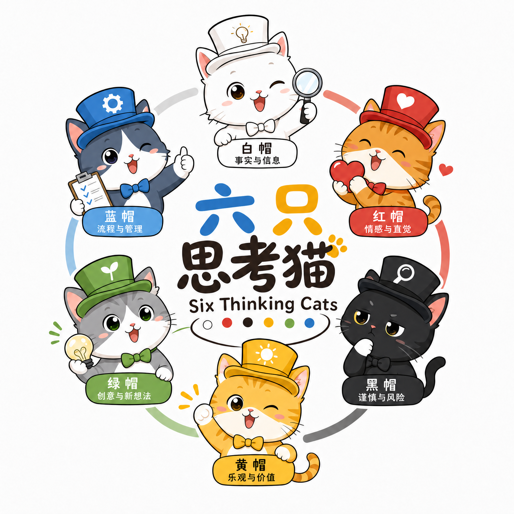
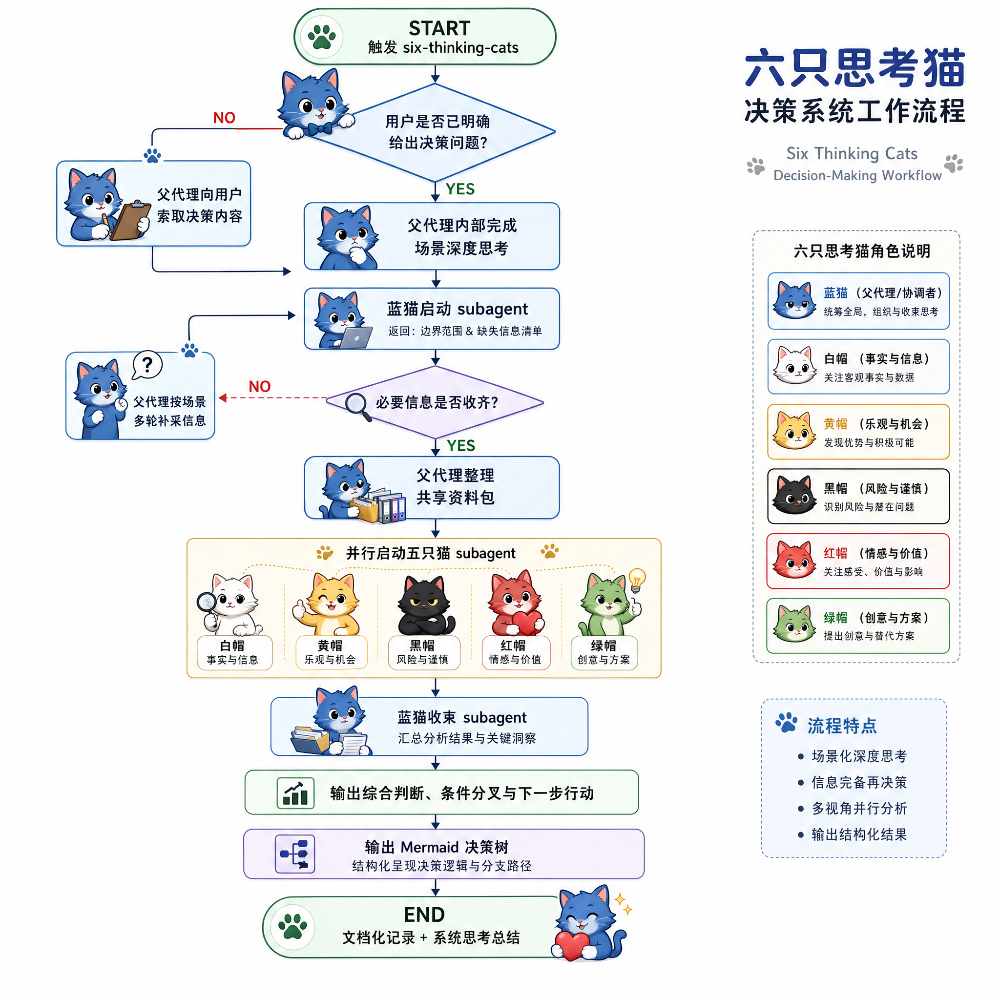

# 六只思考猫（Six Thinking Cats）

<!-- markdownlint-disable MD033 -->
<p align="center">
  
</p>
<!-- markdownlint-enable MD033 -->

**核心概念**：**六只思考猫** | **六顶思考帽** | **苏格拉底式探询**

**六只思考猫**把**六顶思考帽**与**苏格拉底式探询**落成一套面向个人决策的分析协议，以父代理编排、五猫并行、蓝猫收束的默认模型运行；所有 cat subagent 与父代理保持同一模型，并最终把模糊纠结收敛为带条件分叉、下一步行动和 Mermaid 决策树的结论。

这不是应用代码仓库，也不是通用框架包，而是一个面向个人决策场景的提示词与参考资料仓库；核心交付物是 [SKILL.md](SKILL.md)，README 只负责说明这个技能是什么、适合什么场景、该从哪里开始看。

## 六顶思考帽简介（Six Thinking Hats, Briefly）

- **六顶思考帽**由 Edward de Bono 提出，核心不是给人贴人格标签，而是强制一次只用一种思维方式，避免事实、情绪、风险和创意混杂。
- 本仓库把这套方法工程化成**六只思考猫**，并用**苏格拉底式探询**完成前置信息采集；这里的默认执行模型是工程化编排，不等于六顶思考帽理论上的唯一顺序。更完整的理论背景见 [references/framework.md](references/framework.md)。

## 安装与更新（Install / Update）

如果你通过 `skills` CLI 使用这个技能，可直接从仓库安装：

```bash
npx skills add nanzhipro/six-thinking-cats
```

安装名是 `six-thinking-cats`，更新时直接使用该名字：

```bash
npx skills update six-thinking-cats
```

需要跳过交互确认时加 `-y`，需要安装到全局作用域时加 `-g`。

## 适用场景（Best For）

- 工作决策：换工作、职业转型、是否接项目。
- 生活决策：搬家、买房、换车、教育选择。
- 商业决策：创业、合作、产品方向、业务判断。
- 投资决策：资产配置、标的选择、风险取舍。
- 模糊纠结：用户没有明确选项，但明确表达了犹豫、卡住、拿不定主意。

## 典型使用场景

- “我要不要辞职去创业？”
- “现在该不该换工作，还是再等半年？”
- “这个合作能不能接，风险会不会太大？”
- “我有两个方案都不完美，怎么比较才不失真？”
- “我其实还没想清楚选项，但就是一直下不了决心。”

如果你的问题接近上面这些真实决策，这个技能就适合直接上手。

## 实际运行示例（Example）

- 仓库已包含一份完整运行样例：[example/特斯拉换油车.md](example/%E7%89%B9%E6%96%AF%E6%8B%89%E6%8D%A2%E6%B2%B9%E8%BD%A6.md)。
- 这个样例展示了从决策问题、六猫分析、蓝猫收束到 Mermaid 决策树的完整交付链路。
- 示例问题是“要不要把特斯拉换成油车”，当前结论是不换，先完成低成本验证，再决定是否重启换车判断。

## 工作机制与约束（How It Works）

<!-- markdownlint-disable MD033 -->
<p align="center">
  
</p>
<!-- markdownlint-enable MD033 -->

- 父代理先明确决策、完成场景深度思考，并以每轮最多 2 问的方式补齐信息，再整理出共享资料包。
- 五只猫共享同一版资料包，并在与父代理保持同一模型的前提下并行分析；彼此隔离，不能相互读取输出。
- 蓝猫收束是唯一允许跨猫整合的节点，负责给出综合判断、待验证分歧与下一步行动。
- 最终结果必须包含 Mermaid 决策树，并归档到本地 Markdown 文档。
- 详细工作流、输入输出合同和不可协商约束见 [SKILL.md](SKILL.md)，探询原则见 [references/socratic-questioning.md](references/socratic-questioning.md)，subagent 共享规则见 [references/subagent-contract.md](references/subagent-contract.md)。

## 视觉命名（Visual Language）

这个技能用统一的“emoji + 猫名 + 职责”命名规约保持阶段辨识度；宿主界面的真实颜色不可直接配置。

- README 只保留视觉语言的概念说明，不重复展开固定映射。
- 所有 subagent 调用标签和最终输出阶段标题都必须沿用同一套命名。
- 固定映射与共享输出规则见 [references/subagent-contract.md](references/subagent-contract.md)。

## 进一步阅读

- 想直接使用这个技能，优先看 [SKILL.md](SKILL.md)。
- 想理解六顶思考帽的整体理论，再看 [references/framework.md](references/framework.md)。
- 想了解提问与信息采集方式，可看 [references/socratic-questioning.md](references/socratic-questioning.md)。
- 想确认 subagent 的模型、输入和边界约束，可看 [references/subagent-contract.md](references/subagent-contract.md)。
- 想查看单猫阶段规则，可直接进入 [references/blue-cat.md](references/blue-cat.md)、[references/white-cat.md](references/white-cat.md)、[references/yellow-cat.md](references/yellow-cat.md)、[references/black-cat.md](references/black-cat.md)、[references/red-cat.md](references/red-cat.md) 和 [references/green-cat.md](references/green-cat.md)。
