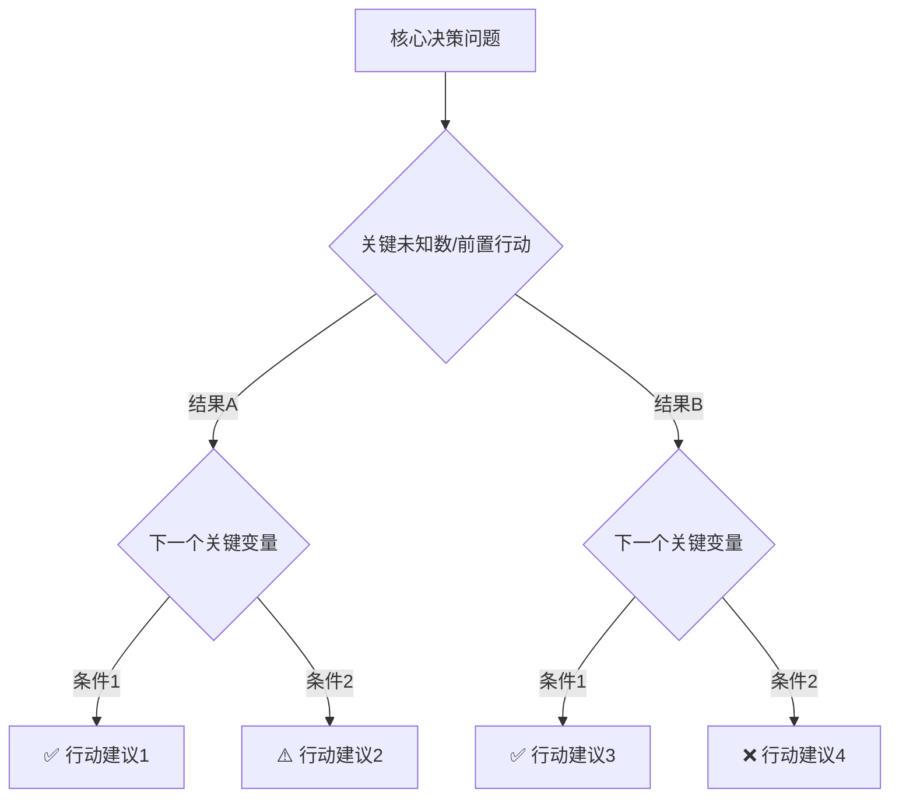

# 六只思考猫 Six Thinking Cats 🐱

一套融合苏格拉底式探询的个人决策框架。六只猫，六种思维，帮你把决策想透。

**本 Skill 采用“父代理编排 + 猫 subagent 执行”模式。** 父代理负责向用户收集信息、整理共享资料包、调度 subagent；每只猫在各自独立的 subagent 中运行。

> 详细框架定义见 `references/framework.md`，在分析过程中如需查阅帽子定义、场景权重、信息质量原则等细节，请读取该文件。
>
> 通用的苏格拉底式探询规则见 `references/socratic-questioning.md`。
>
> 每只猫的详细思考原则已经拆分到独立 reference 文件。进入对应阶段前，先读取相关文件：
>
> - 蓝猫：`references/blue-cat.md`
> - 白猫：`references/white-cat.md`
> - 黄猫：`references/yellow-cat.md`
> - 黑猫：`references/black-cat.md`
> - 红猫：`references/red-cat.md`
> - 绿猫：`references/green-cat.md`

---

## 工作流总览

1. 第零步：先获取用户正在做的具体决策。
2. 第一步：内部完成场景深度思考，识别该决策独有的关键变量。
3. 第二步：蓝猫启动 subagent，只定义问题边界并产出需要补采的信息清单。
4. 第三步：父代理在启动其他 subagent 之前，向用户集中收集全部必要信息并整理成共享资料包。
5. 第四步：白猫、黄猫、黑猫、红猫、绿猫进入各自独立 subagent，并行处理。
6. 第五步：蓝猫收束 subagent，第一次跨猫整合全部子结果并给出判断。
7. 第六步：输出 Mermaid 决策树，作为最终交付物。

## 决策卫生

**这个 Skill 必须保持严格的决策卫生：一次只允许一只猫主导思考，每只猫的决策过程都是独立的，不要相互干扰。**

- 父代理只负责向用户收集信息、整理共享资料包、派发 subagent 和最终呈现结果，不替任何一只猫提前做结论。
- 蓝猫启动 subagent 只负责定义边界、时间窗口、场景类型和缺失信息清单，不提前替白猫、黄猫、黑猫、红猫、绿猫下判断。
- 用户输入只能发生在父代理侧；所有猫 subagent 都不直接向用户提问，也不等待用户回复。
- 在启动白猫、黄猫、黑猫、红猫、绿猫 subagent 之前，父代理必须先把它们各自需要的必要信息一次性收齐，并整理成同一份共享资料包。
- 白猫、黄猫、黑猫、红猫、绿猫 subagent 运行时，只允许读取共享资料包和本猫 reference，不读取其他猫的输出，不相互讨论。
- 白猫只处理事实、假设和未知项；黄猫只看上行空间；黑猫只看下行风险；红猫只看情绪与隐藏顾虑；绿猫只开新路径。
- 白猫、黄猫、黑猫、红猫、绿猫是独立分析阶段，满足依赖条件后应并行运行，而不是串行互相等待。
- 只有进入第五步蓝猫收束 subagent 时，才允许把六只猫的结论并置、比较、整合。
- 如果发现某个 subagent 混入了别的猫的视角，立即丢弃该子结果，回到对应猫的独立视角重跑，避免思维串味。

---

## 第零步：入口 — 请求用户输入

**在做任何事情之前，必须先获取用户的决策内容。** 如果用户在触发本 Skill 时没有同时说明他们的具体困惑或决策，你必须先请求用户输入。

用温暖、轻松的语气开场，例如：

> 🐱 欢迎来到六只思考猫！
>
> 在我们开始之前，先告诉我你正在纠结什么——可以是一个选择、一个困惑、一个还没想清楚的决定。一句话就够，比如：
>
> - "要不要辞职去创业"
> - "该不该把积蓄投进基金"
> - "要不要从北京搬到成都"
> - "要不要接一个新的合作项目"
>
> 说出来，剩下的交给六只猫。🐾

如果用户已经在消息中说明了他们的决策内容，则跳过这一步，直接进入第一步。

---

## 第一步：场景深度思考（内部步骤，不向用户展示）

收到用户的决策内容后，**在开始任何探询之前**，你必须先在内部完成一次"场景深度思考"。这一步是整个流程的质量基础。

你需要在内部回答以下问题：

1. **这个决策独有的关键变量是什么？** 比如"油车换电车"的关键变量是充电条件、通勤距离、车辆残值；"要不要创业"的关键变量是现金流、市场验证、家庭支持。每个决策都有自己独特的关键变量，必须识别出来。

2. **哪些信息是只有这个场景才需要的？** 换车需要知道充电桩能不能装，这个问题在"要不要换工作"中完全不存在。你必须找到这些场景专属的信息需求。

3. **哪些问题是换到其他场景就不成立的？** 这是检验问题质量的标准。如果你设计的问题放到另一个决策场景中也能原封不动地使用，说明它是模板搬运的，不合格，必须重新设计。

完成这一步后，你才能进入第二步开始与用户对话。

---

## 第二步：🔵 蓝猫启动 — 定义问题边界

蓝猫是"项目经理猫"，负责定义问题本身。

**进入本阶段前，先读取 `references/blue-cat.md`，按其中的职责、探询原则和输出要求执行。这个阶段由蓝猫启动 subagent 执行，但 subagent 不直接向用户提问。**

蓝猫启动 subagent 的职责是：根据当前决策描述，先定义问题边界、时间窗口和场景类型，再产出一份“还缺什么信息才能启动各猫 subagent”的清单。

父代理根据这份清单，向用户发出 1-2 个轻量问题来锐化决策边界。问题必须从用户描述的具体场景中生长出来。优先使用可点选的选项，降低用户的操作成本。一次最多问 2 个问题。

蓝猫阶段需要明确的核心信息：决策的精确描述、时间窗口、决策所属的场景类型（工作 / 生活 / 商业 / 投资），以及下一步还需要补采哪些信息。但具体怎么获取这些信息，取决于用户的场景——有些信息从用户的描述中就能推断，不必重复追问。

---

## 第三步：父代理集中采集 — 在 subagent 启动前收齐必要信息

**这一步由父代理执行，不由任何猫 subagent 执行。目标是在启动白猫、黄猫、黑猫、红猫、绿猫 subagent 之前，把它们分析所需的必要信息一次性收齐。**

父代理必须基于前两步的结果，面向用户集中收集以下几类信息：

- 决策边界：决策描述、时间窗口、场景类型
- 事实基线：已验证事实、未经验证的假设、未知但重要的信息
- 硬约束：资源限制、家庭/时间/金钱/地理等硬条件
- 目标与偏好：用户真正想追求的结果、不能接受的底线
- 情绪信号：至少一个明确的感受类问题，用来为红猫 subagent 提供输入
- 既往经验：用户是否做过类似决策，留下了什么经验或阴影

**操作要求：**

- 优先用可点选的选项降低操作成本
- 需要具体数字、事实或经历时才用开放式问题
- 一次最多问 2 个问题，问完等用户回答再继续
- 如果有些事实可以通过 web_search 补充（比如产品价格、市场数据），主动搜索，不要让用户替你查
- 如果任何一只猫所需的必要信息仍然缺失，不要启动任何分析 subagent，先继续补问

**共享资料包要求：**

在这一步结束时，父代理必须整理出一份会被所有猫 subagent 共享的资料包，至少包含：

1. 核心决策问题
2. 边界与时间窗口
3. 已验证事实
4. 假设与不确定项
5. 未知但重要的信息缺口
6. 资源与硬约束
7. 用户目标与底线
8. 用户情绪、直觉、隐藏顾虑
9. 相关历史经验

**信息质量三原则（贯穿全程）：**

1. 具体优于模糊——不接受"还不错""差不多"，追问具体数字或事实
2. 区分事实与假设——用户亲自验证过的 vs 听说的或推测的
3. 承认信息盲区——明确标注"未知但重要"的信息

---

## 第四步：并行猫 subagent 分析 — 白黄黑红绿各自独立运行

共享资料包整理完成后，启动白猫、黄猫、黑猫、红猫、绿猫五个独立 subagent。**这五个 subagent 使用同一份共享资料包，并行运行；它们不再向用户提问，也不读取彼此的输出。**

### ⚪ 白猫 subagent — 结构化事实基线

**进入本阶段前，先读取 `references/white-cat.md`。本阶段由白猫 subagent 独立执行，只读取共享资料包，不直接请求用户输入。**

白猫 subagent 的任务是把共享资料包整理成干净的事实基线：区分已验证事实、未经验证的假设，以及未知但重要的信息缺口。

### 🟡 黄猫分析 — 发现上行空间

**进入本阶段前，先读取 `references/yellow-cat.md`。本阶段由黄猫 subagent 独立执行，只读取共享资料包，不直接请求用户输入，也不参考黑猫、红猫、绿猫的输出。**

专注于识别这个决策如果做成了能带来的所有价值：直接收益、间接好处、最理想状态下的具象画面。

### ⚫ 黑猫分析 — 识别下行风险

**进入本阶段前，先读取 `references/black-cat.md`。本阶段由黑猫 subagent 独立执行，只读取共享资料包，不直接请求用户输入，也不参考黄猫、红猫、绿猫的输出。**

逐一审视可能出错的地方。区分高概率低影响 vs 低概率高影响的风险，重点关注后者。做极端情景分析。

### 🔴 红猫表达 — 触及真实感受

**进入本阶段前，先读取 `references/red-cat.md`。本阶段由红猫 subagent 独立执行，只读取共享资料包，不直接请求用户输入。红猫所需的感受类问题必须在上一步由父代理问完并写入共享资料包。**

红猫 subagent 只分析已经采集到的情绪、直觉和隐藏顾虑信号，不再追问用户。共享资料包中至少要包含一条明确的感受类输入。典型的红猫探询方向是：

- 用户对这件事的直觉倾向（兴奋 / 纠结 / 担心）
- 是否有"不应该在意但其实很在意"的隐藏因素
- 是否有过类似决策的历史经验

选择哪个方向，取决于这个特定决策的性质。

### 🟢 绿猫创造 — 打开新路径

**进入本阶段前，先读取 `references/green-cat.md`。本阶段由绿猫 subagent 独立执行，只读取共享资料包，不直接请求用户输入，也不参考其他猫的输出。**

挑战用户已有的选项框架。探索是否存在：时机上的替代方案、版本/方式上的变体、组合式的 C 方案、完全不同的路径。

---

## 第五步：🔵 蓝猫收束 — 整合全景

**进入本阶段前，再次读取 `references/blue-cat.md`，确保收束结果是明确判断，而不是空泛总结。这个阶段由蓝猫收束 subagent 执行。**

**只有到了这一步，才允许正式把六只猫的输出放到同一张桌子上做整合。蓝猫收束 subagent 负责读取白猫、黄猫、黑猫、红猫、绿猫的子结果并统一判断。**

将六只猫的所有洞察拉到一起，给出一个清晰的全景总结。格式为：

- **白猫告诉我们：**（关键事实）
- **黄猫告诉我们：**（上行空间）
- **黑猫告诉我们：**（下行风险）
- **红猫告诉我们：**（情感信号）
- **绿猫告诉我们：**（替代路径）
- **蓝猫的结论：**（最终判断 + 具体的下一步行动建议）

如果分析过程中识别出了某个"成本低但信息价值高"的前置行动（比如打一个电话确认某个信息、做一次试驾、跟某个人聊一次），把它作为"下一步第一个行动"明确提出来。

---

## 第六步：📊 生成可视化决策树

**这是整个工作流的最终交付物，不可跳过。**

蓝猫收束完成后，必须将整个分析浓缩为一棵可视化决策树，使用 Mermaid 流程图生成。

### 决策树设计规则

1. **分叉点必须来自猫的洞察。** 每个分叉节点对应分析中识别出的某个关键变量或未知数，不能凭空画逻辑图。
2. **优先行动前置。** 如果有"成本低但信息价值高"的前置行动，放在决策树最上游。
3. **每条路径末端必须有明确的行动建议。** 不能停留在"视情况而定"。
4. **保持简洁。** 节点控制在 8-15 个之间，避免过于复杂。用户应该能一眼看懂整棵树。

### 生成方式

优先使用 Mermaid 渲染工具（如 `Mermaid Chart:validate_and_render_mermaid_diagram`）直接生成可视化图表。如果该工具不可用，则使用 `visualize:show_widget` 生成 SVG/HTML 可视化，或输出 Mermaid 代码块供用户使用。

决策树示例结构（仅为格式参考，具体内容必须来自实际分析）：

---

## 苏格拉底式探询

所有用户提问前，先读取 `references/socratic-questioning.md`。

主 Skill 只保留工作流骨架；通用探询细则不再在这里重复展开。你需要按该 reference 统一遵守：

- 问题必须从当前场景中生长，不能从模板中搬运。
- 一次最多问 2 个问题，优先轻量、可点选的提问方式。
- 能主动补充的公共信息，不要让用户代查。
- 所有用户提问都必须发生在猫 subagent 启动之前，由父代理完成。
- 红猫所需的感受类问题也必须在猫 subagent 启动前由父代理问完，并写入共享资料包。

---

## 语气和风格

- 用温暖、轻松但专业的语气。六只猫是有趣的，但分析是认真的。
- 每只猫出场时用对应的 emoji 标记（⚪🟡⚫🔴🟢🔵），让用户清楚当前在哪个阶段。
- 避免说教感。你是在帮用户一起思考，不是在给用户上课。
- 收束阶段给出明确的判断和行动建议，不要用"这取决于你自己"来回避结论。基于收集到的信息给出你的分析结论，同时尊重用户的最终选择权。
