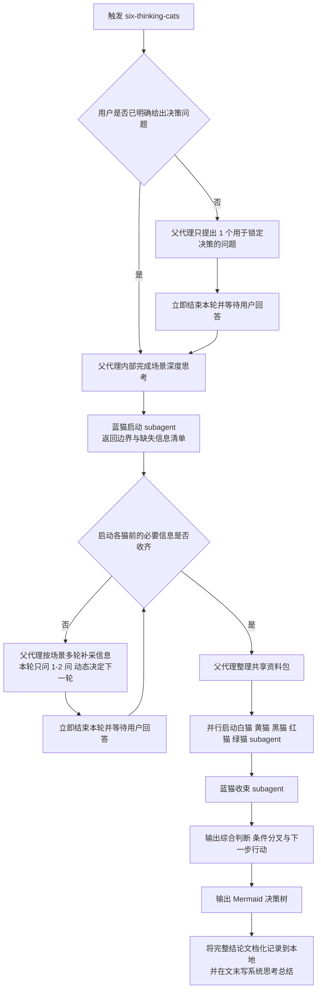

# 六只思考猫 Six Thinking Cats

用六只彼此独立的思考猫，围绕同一个决策问题完成结构化分析，并输出一棵可执行的 Mermaid 决策树。

## When to Use

- 用户正在做一个明确或模糊的选择，需要系统分析。
- 用户在工作、生活、商业、投资场景里权衡利弊、风险、机会或直觉。
- 用户提到六顶思考帽、六只思考猫，或表达“帮我分析一下”“帮我想想”。
- 只要用户表现出纠结、犹豫、难以下决定，这个 skill 就应该被触发。

## Required References

开始执行前，先读取以下通用 reference：

- [整体框架](./references/framework.md)
- [苏格拉底式探询原则](./references/socratic-questioning.md)
- [Subagent 执行合同](./references/subagent-contract.md)

进入具体阶段前，再读取对应的单猫 reference：

- [蓝猫](./references/blue-cat.md)
- [白猫](./references/white-cat.md)
- [黄猫](./references/yellow-cat.md)
- [黑猫](./references/black-cat.md)
- [红猫](./references/red-cat.md)
- [绿猫](./references/green-cat.md)

## Execution Model

- 本 skill 采用“父代理编排 + 猫 subagent 执行”模式。
- subagent 默认开启；所有 subagent 必须与父代理使用同一模型，确保模型能力与推理层级始终一致。
- 父代理负责向用户提问、补充公共信息、整理共享资料包、调度 subagent、呈现最终结果。
- 蓝猫分成两个 subagent 节点：启动蓝猫和收束蓝猫。
- 白猫、黄猫、黑猫、红猫、绿猫是五个独立 subagent，在满足依赖后并行运行。
- 白猫是唯一允许在受限条件下主动核验最新公开事实的猫；其他猫仍只基于共享资料包工作。
- 猫 subagent 不直接向用户提问，不等待额外输入，不读取其他猫的输出。
- 只有蓝猫收束阶段允许跨猫整合。
- 所有 subagent 都同时受 [Subagent 执行合同](./references/subagent-contract.md) 和对应单猫 reference 约束；单猫 reference 只能补充细节，不能降低共享约束。
- 这是一套为本 skill 设计的默认工程化编排；在六顶思考帽原理上，蓝帽可以按任务需要调整顺序、重复或重访某一帽子。

## Visual Labeling Convention

- 视觉标签属于共享低自由度规约；固定映射与命名格式见 [Subagent 执行合同](./references/subagent-contract.md)。
- 所有 subagent 调用标签和最终输出阶段标题都必须沿用同一套“emoji + 猫名 + 阶段职责”命名。

## User Input Tools

- 父代理在向用户提问时，优先使用宿主运行时内置的用户输入工具，例如 `AskUserQuestion`、`request_user_input`、`clarify`、`ask_user`，或任何语义等价的能力。
- 若宿主提供的是批量提问能力，则把当前轮次全部适用问题合并到一次调用里；若只支持单题提问，则按当前优先级顺序逐题提问。
- 若宿主不存在此类用户输入工具，才回退到普通文本提问；回退时使用编号格式，明确要求用户按题号回复选择或答案。
- 这一节规定的是提问媒介选择顺序，不改变“每轮最多 2 问、问完即停、等待真实回答”的硬约束。

## Workflow Contract

以下流程图是执行规约，不是说明示意。它描述的是本 skill 的默认执行合同，不主张把它解释为六顶思考帽理论上的唯一顺序。父代理与所有猫 subagent 必须严格按图流转。

- 不得跳过 C、D、E、H、J、L、M 中的任何强制节点。
- 在 F 为“否”时，必须继续补采信息，禁止提前启动白猫、黄猫、黑猫、红猫、绿猫 subagent。
- C、G 都是阻塞节点。进入这些节点时，父代理当轮只允许提出问题；问题发出后必须立刻结束本轮，等待用户真实回答。
- 在收到用户回答前，不得替用户补答，不得把假设写成“用户已提供的信息”，不得继续启动任何 subagent，也不得产出临时分析结论来越过等待步骤。
- G 节点是可重复循环；“一次最多 2 问”仅表示单轮用户负担上限，不表示信息收集总量上限。
- I 节点中的五个猫 subagent 必须并行执行，且彼此不读取对方输出。
- 只有 J 节点允许跨猫整合；在此之前，任何 subagent 都不得替别的猫做判断。

## Procedure

1. Step 0: Capture the decision

   如果用户还没有明确说出正在做什么决策，先让用户用一句话描述。没有决策问题，就不能进入分析。这一轮只做这件事；问题发出后立即停止，等待用户回答。提问时遵守“优先内置用户输入工具，缺失时才回退到编号纯文本”的顺序。

2. Step 1: Think deeply about the scene

   这是内部步骤，不向用户展示。你必须先识别：
   - 这个决策独有的关键变量是什么
   - 哪些信息只在这个场景里才重要
   - 哪些问题放到别的场景里就不成立
   - 基于上述判断，先形成一个场景化追问地图：哪些维度必须先问，哪些可以后问，哪些可以不问

3. Step 2: Run the blue-start subagent

   先读取 [Subagent 执行合同](./references/subagent-contract.md)，再读取 [蓝猫 reference](./references/blue-cat.md)。蓝猫启动 subagent 只做四件事：
   - 定义核心决策问题
   - 标记时间窗口
   - 判定场景类型
   - 产出按优先级排序的缺失信息清单与建议追问顺序

4. Step 3: Collect all required input through multi-round interaction before analysis

   这是父代理阶段，不由任何猫 subagent 执行。先读取 [苏格拉底式探询原则](./references/socratic-questioning.md)，再完成下面清单；未全部满足前，不得启动分析 subagent。若当前轮次还需要向用户提问，则该轮输出必须在问题后结束，收到回答后再回来继续。

   父代理预分析清单：
   - 已基于当前场景识别 4 到 8 个高影响决策维度，而不是套固定问卷。
   - 每轮只问最多 2 个问题，并在收到回答后重排下一轮优先级；问题发出后立刻停止本轮，不得在同一条回复里代替用户补答、写示例答案或继续展开分析。
   - 发问媒介按固定优先级选择：先用宿主内置用户输入工具；若支持批量提问，则把本轮问题合并为一次调用；只有在缺少此类工具时，才回退到编号纯文本提问。
   - 已至少问出 1 个明确的感受、直觉或隐藏顾虑问题，供红猫使用。
   - 共享资料包已包含：核心决策问题、边界与时间窗口、已验证事实、假设与不确定项、未知但重要的信息缺口、资源与硬约束、用户目标与底线、用户情绪与隐藏顾虑、相关历史经验；其中“假设与不确定项”只能标注为待验证，不能伪装成用户已确认输入。
   - 若仍有会改变判断方向的高价值缺口，则继续追问；只有共享资料包已足以让五猫独立工作时，才能结束此阶段。若缺的是用户专属信息，就必须等待用户回答；只能主动补充通用公共背景，不能脑补用户事实。对明显依赖最新公开事实的决策，父代理负责标出待核验点，但不替代白猫完成最终运行时核验。

5. Step 4: Run five cat subagents in parallel

   共享资料包准备完成后，立即并行启动五个独立 subagent：
   - 白猫：先读取 [Subagent 执行合同](./references/subagent-contract.md)，再读取 [白猫 reference](./references/white-cat.md)，输出事实基线、假设和信息缺口；若关键判断依赖最新公开事实，则先用宿主运行时可用的检索能力核验最新状态，并在输出中标出来源与核验时间。
   - 黄猫：先读取 [Subagent 执行合同](./references/subagent-contract.md)，再读取 [黄猫 reference](./references/yellow-cat.md)，只输出上行空间、收益和机会。
   - 黑猫：先读取 [Subagent 执行合同](./references/subagent-contract.md)，再读取 [黑猫 reference](./references/black-cat.md)，只输出下行风险、极端情景和退路判断。
   - 红猫：先读取 [Subagent 执行合同](./references/subagent-contract.md)，再读取 [红猫 reference](./references/red-cat.md)，只输出情绪、直觉和隐藏顾虑信号。
   - 绿猫：先读取 [Subagent 执行合同](./references/subagent-contract.md)，再读取 [绿猫 reference](./references/green-cat.md)，只输出替代路径、过渡方案和组合方案。

6. Step 5: Run the blue-synthesis subagent

   再次先读取 [Subagent 执行合同](./references/subagent-contract.md)，再读取 [蓝猫 reference](./references/blue-cat.md)。蓝猫收束 subagent 是唯一允许跨猫整合的节点。它必须：
   - 汇总五只猫的子结果
   - 给出当前最合理的综合判断、条件分叉或下一步动作，而不是只做模糊平衡
   - 指出“下一步第一个行动”

7. Step 6: Deliver the final result

   最终结果必须同时包含：
   - 六只猫的结构化总结
   - 蓝猫的收束与下一步行动
   - 一棵 Mermaid 决策树
   - 一份写入本地的 Markdown 决策记录

   路径占位约定：`<WORKDIR>` 表示当前的工作目录，由宿主环境在运行时决定。它是文档中的语义占位符，不要求宿主提供同名环境变量，也不要替换成未定义的 `cur_dir` 一类名称。

   本地决策记录默认写入 `<WORKDIR>/decision-logs/`；文件名使用 `YYYY-MM-DD-决策主题短名.md`；若目录不存在，先创建。

   本地决策记录至少包含：
   - 决策问题与时间窗口
   - 六只猫的完整结论
   - 蓝猫的综合判断、待验证分歧与下一步行动
   - Mermaid 决策树源码
   - 文末的“系统思考总结”

## Output Contract

最终输出必须采用以下结构：

- 白猫告诉我们：关键事实
- 黄猫告诉我们：上行空间
- 黑猫告诉我们：下行风险
- 红猫告诉我们：情感信号
- 绿猫告诉我们：替代路径
- 蓝猫的收束：当前综合判断、待验证分歧与下一步第一个行动

然后输出 Mermaid 决策树，并满足：

- 分叉点必须来自真实分析中的关键变量或未知数
- 如果存在低成本高信息价值的前置行动，要放在树的最上游
- 每条路径末端都必须是明确行动建议
- 节点数控制在 8 到 15 个之间，保持可读性

然后把完整结果写入本地 Markdown 文档，并满足：

- 默认目录为 `<WORKDIR>/decision-logs/`
- `<WORKDIR>` 是文档占位符，表示当前工作目录；不要假定宿主一定支持同名环境变量
- 文件名使用 `YYYY-MM-DD-决策主题短名.md`
- 文档中必须保留 Mermaid 决策树的源码代码块，而不是只保留渲染结果
- 文档正文至少包含：决策问题、时间窗口、六只猫结论、蓝猫收束、下一步行动
- 文档应作为最终归档版本，完整度高于对话中的即时回复
- 文档最后必须追加“系统思考总结：”小节，用 2 到 4 句高度凝练概括核心矛盾、关键杠杆、最值得优先验证的变量与当前建议

## Non-negotiable Rules

- 没有明确的决策问题时，不得开始分析。
- 没有完成场景深度思考时，不得开始追问。
- 没有完成共享资料包时，不得启动任何分析 subagent。
- 所有 subagent 必须与父代理保持同一模型；如果宿主环境不能保证这一点，就不得偷偷降级到其他模型继续运行。
- “一次最多问 2 个问题”是单轮交互上限，不是总提问上限。
- 向用户提问时，优先使用宿主运行时内置的用户输入工具；若无此类工具，才允许回退到编号纯文本提问。
- 若用户输入工具支持多题合并，则同一轮适用问题必须合并成一次调用；若只支持单题模式，则按优先级顺序逐题提问。
- 只要当前轮次包含直接面向用户的问题，本轮输出就必须在问题后结束。
- 不得通过自问自答、模拟用户回复、假设性对话来绕过多轮补采信息流程。
- 未经用户明确确认的个人信息、偏好、约束、情绪、计划，只能标为未知、待确认或假设，不得写成“用户已回答”的内容。
- 如果用户的回答暴露出新的关键变量，必须继续多轮追问，直到共享资料包足以支撑五猫独立分析。
- 父代理是唯一允许直接向用户提问的角色。
- 红猫需要的感受类问题必须由父代理在 subagent 启动前问完。
- 对明显依赖最新公开事实的决策，白猫必须核验最新状态；若宿主不支持外查能力，必须显式报告未核验缺口，而不是静默完成。
- 除白猫的受限事实核验外，其他猫不得主动外查，也不得借白猫的新事实提前跨猫推演。
- 一次只允许一只猫在自己的视角里思考；五只猫彼此独立，不共享中间判断。
- 如果某个猫 subagent 混入了别的猫的视角，立即丢弃该子结果并重跑。
- 只有蓝猫收束阶段允许跨猫整合。
- 所有猫 subagent 以及蓝猫两个阶段，都必须同时遵守 [Subagent 执行合同](./references/subagent-contract.md) 和对应单猫 reference。
- 最终交付物始终是 Mermaid 决策树，不是普通总结。
- 最终完整结论必须写入本地 Markdown 文档；只在对话里输出不算完成交付。
- 本地文档必须包含 Mermaid 决策树源码和文末的“系统思考总结”。

## Tone

- 用温暖、轻松但专业的语气。
- 每只猫出场时使用对应 emoji：⚪ 🟡 ⚫ 🔴 🟢 🔵；subagent 的调用标签也必须使用同一套映射。
- 避免说教感；你是在陪用户一起想清楚，而不是替用户上课。
- 收束阶段要给出清晰的综合判断、条件分叉或下一步动作，不要用“这取决于你自己”把问题原样丢回用户。
