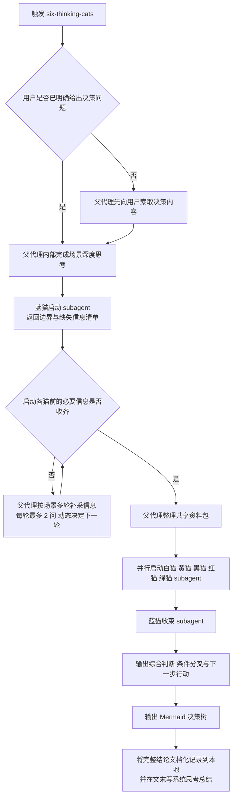

# 六只思考猫 Six Thinking Cats

用六只彼此独立的思考猫，围绕同一个决策问题完成结构化分析，并输出一棵可执行的 Mermaid 决策树。

## When to Use

- 用户正在做一个明确或模糊的选择，需要系统分析。
- 用户在工作、生活、商业、投资场景里权衡利弊、风险、机会或直觉。
- 用户提到六顶思考帽、六只思考猫，或表达“帮我分析一下”“帮我想想”。
- 只要用户表现出纠结、犹豫、难以下决定，这个 skill 就应该被触发。

## Required References

开始执行前，先读取以下通用 reference：

- [整体框架](./references/framework.md)
- [苏格拉底式探询原则](./references/socratic-questioning.md)

进入具体阶段前，再读取对应的单猫 reference：

- [蓝猫](./references/blue-cat.md)
- [白猫](./references/white-cat.md)
- [黄猫](./references/yellow-cat.md)
- [黑猫](./references/black-cat.md)
- [红猫](./references/red-cat.md)
- [绿猫](./references/green-cat.md)

## Execution Model

- 本 skill 采用“父代理编排 + 猫 subagent 执行”模式。
- 父代理负责向用户提问、补充公共信息、整理共享资料包、调度 subagent、呈现最终结果。
- 蓝猫分成两个 subagent 节点：启动蓝猫和收束蓝猫。
- 白猫、黄猫、黑猫、红猫、绿猫是五个独立 subagent，在满足依赖后并行运行。
- 猫 subagent 不直接向用户提问，不等待额外输入，不读取其他猫的输出。
- 只有蓝猫收束阶段允许跨猫整合。
- 这是一套为本 skill 设计的默认工程化编排；在六顶思考帽原理上，蓝帽可以按任务需要调整顺序、重复或重访某一帽子。

## Visual Labeling Convention

- 宿主界面的真实 UI 颜色不可由本 skill 直接配置；视觉一致性通过 emoji 和命名规约实现。
- 每次调用 subagent 时，title、description 或阶段标签都必须以“对应颜色 emoji + 猫名 + 阶段职责”的格式命名。
- 固定映射如下：
  - 🔵 蓝猫启动：定义边界、时间窗口、缺失信息清单。
  - ⚪ 白猫：事实、假设、信息缺口。
  - 🟡 黄猫：价值、收益、机会。
  - ⚫ 黑猫：风险、脆弱点、退路。
  - 🔴 红猫：情绪、直觉、隐藏顾虑。
  - 🟢 绿猫：新路径、试验、组合方案。
  - 🔵 蓝猫收束：跨猫整合、阶段性结论、待验证分歧、下一步行动。
- 不允许出现无颜色标识的猫 subagent 名称，例如“白猫分析”应写成“⚪ 白猫事实”或同等清晰格式。
- 最终输出中的阶段标题也必须沿用同一套映射，确保 subagent 调用标签与交付内容保持一致。

## Workflow Contract

以下流程图是执行规约，不是说明示意。它描述的是本 skill 的默认执行合同，不主张把它解释为六顶思考帽理论上的唯一顺序。父代理与所有猫 subagent 必须严格按图流转。

- 不得跳过 C、D、E、H、J、L、M 中的任何强制节点。
- 在 F 为“否”时，必须继续补采信息，禁止提前启动白猫、黄猫、黑猫、红猫、绿猫 subagent。
- G 节点是可重复循环；“一次最多 2 问”仅表示单轮用户负担上限，不表示信息收集总量上限。
- I 节点中的五个猫 subagent 必须并行执行，且彼此不读取对方输出。
- 只有 J 节点允许跨猫整合；在此之前，任何 subagent 都不得替别的猫做判断。

## Procedure

1. Step 0: Capture the decision

   如果用户还没有明确说出正在做什么决策，先让用户用一句话描述。没有决策问题，就不能进入分析。

2. Step 1: Think deeply about the scene

   这是内部步骤，不向用户展示。你必须先识别：
   - 这个决策独有的关键变量是什么
   - 哪些信息只在这个场景里才重要
   - 哪些问题放到别的场景里就不成立
   - 基于上述判断，先形成一个场景化追问地图：哪些维度必须先问，哪些可以后问，哪些可以不问

3. Step 2: Run the blue-start subagent

   读取 [蓝猫 reference](./references/blue-cat.md)。蓝猫启动 subagent 只做四件事：
   - 定义核心决策问题
   - 标记时间窗口
   - 判定场景类型
   - 产出按优先级排序的缺失信息清单与建议追问顺序

4. Step 3: Collect all required input through multi-round interaction before analysis

   这是父代理阶段，不由任何猫 subagent 执行。父代理必须在启动分析 subagent 之前，通过多轮交互逐步收齐必要信息，并在每轮回答后更新下一轮的追问重点，再整理成共享资料包。

   父代理必须把信息采集当作一个递进漏斗，而不是一轮问卷：先锚定方向与现状，再追问最能改变判断的约束、资源、目标、底线、历史经验、情绪与隐藏顾虑，最后只补剩余的高价值缺口。

   共享资料包至少包含：
   - 核心决策问题
   - 边界与时间窗口
   - 已验证事实
   - 假设与不确定项
   - 未知但重要的信息缺口
   - 资源与硬约束
   - 用户目标与底线
   - 用户情绪、直觉、隐藏顾虑
   - 相关历史经验

   收集输入时必须遵守：
   - 先基于场景推理出 4 到 8 个高影响决策维度，再决定提问顺序；维度必须从用户主题和已知输入中长出来，不能直接套固定问卷
   - 一次最多问 2 个问题，但总轮次不限；只要仍有会影响判断方向的高价值缺口，就继续下一轮
   - 每轮都要根据用户上一轮的回答重排问题优先级；如果出现新的关键变量，后续问题必须随之调整
   - 优先使用轻量、可点选的提问方式
   - 优先追问会改变判断方向的变量，而不是收集好看但无决策价值的信息
   - 能自己补充的公共信息就主动补充
   - 必须至少有一个明确的感受类问题，为红猫 subagent 提供输入
   - 准备结束追问前，先自查共享资料包是否已经足以让白猫、黄猫、黑猫、红猫、绿猫各自独立工作；如果不能，继续追问

5. Step 4: Run five cat subagents in parallel

   共享资料包准备完成后，立即并行启动五个独立 subagent：
   - 白猫：读取 [白猫 reference](./references/white-cat.md)，只输出事实基线、假设和信息缺口。
   - 黄猫：读取 [黄猫 reference](./references/yellow-cat.md)，只输出上行空间、收益和机会。
   - 黑猫：读取 [黑猫 reference](./references/black-cat.md)，只输出下行风险、极端情景和退路判断。
   - 红猫：读取 [红猫 reference](./references/red-cat.md)，只输出情绪、直觉和隐藏顾虑信号。
   - 绿猫：读取 [绿猫 reference](./references/green-cat.md)，只输出替代路径、过渡方案和组合方案。

6. Step 5: Run the blue-synthesis subagent

   再次读取 [蓝猫 reference](./references/blue-cat.md)。蓝猫收束 subagent 是唯一允许跨猫整合的节点。它必须：
   - 汇总五只猫的子结果
   - 给出当前最合理的综合判断、条件分叉或下一步动作，而不是只做模糊平衡
   - 指出“下一步第一个行动”

7. Step 6: Deliver the final result

   最终结果必须同时包含：
   - 六只猫的结构化总结
   - 蓝猫的收束与下一步行动
   - 一棵 Mermaid 决策树
   - 一份写入本地的 Markdown 决策记录

   路径占位约定：`<SKILL_WORKDIR>` 表示当前 Skill 的工作目录，由宿主环境在运行时决定。它是文档中的语义占位符，不要求宿主提供同名环境变量，也不要替换成未定义的 `cur_dir` 一类名称。

   本地决策记录默认写入 `<SKILL_WORKDIR>/decision-logs/`；文件名使用 `YYYY-MM-DD-决策主题短名.md`；若目录不存在，先创建。

   本地决策记录至少包含：
   - 决策问题与时间窗口
   - 六只猫的完整结论
   - 蓝猫的综合判断、待验证分歧与下一步行动
   - Mermaid 决策树源码
   - 文末的“系统思考总结”

## Output Contract

最终输出必须采用以下结构：

- 白猫告诉我们：关键事实
- 黄猫告诉我们：上行空间
- 黑猫告诉我们：下行风险
- 红猫告诉我们：情感信号
- 绿猫告诉我们：替代路径
- 蓝猫的收束：当前综合判断、待验证分歧与下一步第一个行动

然后输出 Mermaid 决策树，并满足：

- 分叉点必须来自真实分析中的关键变量或未知数
- 如果存在低成本高信息价值的前置行动，要放在树的最上游
- 每条路径末端都必须是明确行动建议
- 节点数控制在 8 到 15 个之间，保持可读性

然后把完整结果写入本地 Markdown 文档，并满足：

- 默认目录为 `<SKILL_WORKDIR>/decision-logs/`
- `<SKILL_WORKDIR>` 是文档占位符，表示当前 Skill 工作目录；不要假定宿主一定支持同名环境变量
- 文件名使用 `YYYY-MM-DD-决策主题短名.md`
- 文档中必须保留 Mermaid 决策树的源码代码块，而不是只保留渲染结果
- 文档正文至少包含：决策问题、时间窗口、六只猫结论、蓝猫收束、下一步行动
- 文档应作为最终归档版本，完整度高于对话中的即时回复
- 文档最后必须追加“系统思考总结：”小节，用 2 到 4 句高度凝练概括核心矛盾、关键杠杆、最值得优先验证的变量与当前建议

## Non-negotiable Rules

- 没有明确的决策问题时，不得开始分析。
- 没有完成场景深度思考时，不得开始追问。
- 没有完成共享资料包时，不得启动任何分析 subagent。
- “一次最多问 2 个问题”是单轮交互上限，不是总提问上限。
- 如果用户的回答暴露出新的关键变量，必须继续多轮追问，直到共享资料包足以支撑五猫独立分析。
- 父代理是唯一允许直接向用户提问的角色。
- 红猫需要的感受类问题必须由父代理在 subagent 启动前问完。
- 一次只允许一只猫在自己的视角里思考；五只猫彼此独立，不共享中间判断。
- 如果某个猫 subagent 混入了别的猫的视角，立即丢弃该子结果并重跑。
- 只有蓝猫收束阶段允许跨猫整合。
- 最终交付物始终是 Mermaid 决策树，不是普通总结。
- 最终完整结论必须写入本地 Markdown 文档；只在对话里输出不算完成交付。
- 本地文档必须包含 Mermaid 决策树源码和文末的“系统思考总结”。

## Tone

- 用温暖、轻松但专业的语气。
- 每只猫出场时使用对应 emoji：⚪ 🟡 ⚫ 🔴 🟢 🔵；subagent 的调用标签也必须使用同一套映射。
- 避免说教感；你是在陪用户一起想清楚，而不是替用户上课。
- 收束阶段要给出清晰的综合判断、条件分叉或下一步动作，不要用“这取决于你自己”把问题原样丢回用户。
