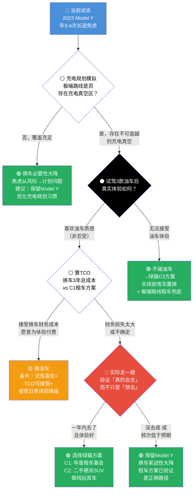

# 决策记录：要不要把特斯拉换成油车

**决策日期**：2026-05-03
**时间窗口**：1-3 个月（不紧迫，国庆前决定即可）
**场景类型**：生活决策 + 轻度消费投资交叉
**当前状态**：不换。保留 Model Y，建立长途租车基金。待完成实验清单后重新评估。

---

## 决策问题

用户是否应该卖掉 2023 款特斯拉 Model Y（CLTC 续航 423km，实际高速续航约 320-350km），换购一辆 20 多万的纯燃油车，以消除每年 3-4 次长途自驾（含大西北、新疆、海南等路线）中的充电焦虑，同时接受日常通勤成本上升和用车体验的改变。

核心由一次真实创伤驱动：某次长途排队充电 + 续航计算失误，差点趴窝。

---

## 关键事实基线

- **当前车辆**：2023 款 Model Y，有固定家充桩，日常通勤单程 5km
- **长途频率**：一年约 3-4 次，自驾目标包括大西北、新疆、海南
- **换车目标**：20 多万纯油车，安全和稳定优先。已明确排除插混/增程
- **关键盲区**：从未开过燃油车，从未试驾过任何油车，没有具体意向车型
- **财务**：2023 款 Model Y 当前残值约 12-15 万（当年新车约 26 万），折旧 10-14 万
- **油费增量**：年里程约 5000-7000km，换油车后月均油费增量约 170-300 元

---

## ⚪ 白猫告诉我们：信息基线

**已验证事实**：2023 款 Model Y 标准续航版，CLTC 423km，高速实际约 320-350km。有家充桩，日常通勤 5km。年 3-4 次长途，自驾目标大西北/新疆/海南。曾因排队+续航算错差点趴窝。从未开过油车。预算 20 多万，要安全稳定。

**未核验**：大西北/新疆充电桩覆盖（公共知识而非用户亲自确认）；具体路线上充电站的分布和可用性；特斯拉当前精确残值。

**关键假设**：充电焦虑只出现在长途，换油车能彻底消除焦虑，用户能适应油车体验——最后一个假设因用户从未开过油车而最脆弱。

**最高优先级信息缺口**：
1. 用户具体自驾路线的充电覆盖情况
2. 租燃油车长途 vs 换车的成本对比
3. 特斯拉当前精确残值
4. 试驾油车的真实体感

---

## 🟡 黄猫告诉我们：上行空间

**直接收益**：长途补能焦虑彻底消除；梦想路线（新疆/大西北）从"困难/不可达"变为"可行"；每次长途多出 1-2 小时有效旅行时间。

**关键反直觉发现**：年里程仅 5000-7000km，油费增量每月仅约 170-300 元（年 2000-3500 元），绝对金额极小——"油费高"的恐惧远大于数学现实。

**间接收益**：说走就走的自由、偏远地区可维修性、完整的驾驶体验谱系、出行决策半径扩大。

**成功画面**：换了之后，每次出发想的都是"去哪玩"而不是"在哪充"。出行决策半径从 400km 扩大到 800km+。

---

## ⚫ 黑猫告诉我们：下行风险

**最脆弱前提**：用户从未开过油车，在用"想象中的油车"对比"真实的电车痛点"。试驾 3 款以上油车之前，不应讨论"换不换"。

**红色级风险**：
- **体验断崖式下降**：动力响应延迟、发动机噪音振动、换挡顿挫、无单踏板、智能化降级、不能安全地原地开空调
- **财务损失不可逆**：特斯拉折旧 10-14 万 + 油车首年折旧 3-5 万 = 两年内总折损 15-19 万。这笔钱够租 7-10 年长途自驾的车
- **5km 短途通勤对油车是慢性伤害**：发动机从不达到工作温度，积碳、磨损、亏电
- **身份标签失落**：从"科技前卫的电车原生用户"变成"开油车的"

**尾部风险**：买到问题车（无油车选购经验）、油车政策风险、重大事故中安全差异。

**最坏情况**：换完后悔 → 再换回电车 → 总成本约 40-45 万才能回到原点，净损失 13-19 万。退路存在但代价极高。

---

## 🔴 红猫告诉我们：情感信号

**主导情绪**：焦虑驱动下的"逃离式决断"，不是"想要油车"而是"不想再经历那种恐慌"。情绪驱动比例约 70%。

**关键错位**：嘴上说"要安全稳定"，心里说的是"想去远方但不想焦虑"。说"希望成本不要太高"但已做出日常成本更高的决策方向。

**隐藏顾虑**：身份标签失落（特斯拉车主的科技光环 → 普通油车车主）、对残值损失的情感回避（说"不懂"不是真不懂，是不想面对数字会破坏决策冲动）。

**最大心理盲区**：从未开过油车但已经确信它是答案——"像一个从没谈过恋爱的人眼中的完美恋人"。

---

## 🟢 绿猫告诉我们：替代路径

**重新定义问题**：真正的问题不是"换不换车"，而是"如何用最低成本解决一年 3-4 次的长途焦虑"。一旦这样定义，最优解从"卖特斯拉买油车"变为"保留 Model Y + 按需租车"。

**C1 方案（最推荐）**：保留 Model Y 日常 + 每年拨 15,000-20,000 元长途租车基金。10-14 万的折旧损失够租 7-10 年的车，每次还能按目的地选最合适的车型。

**C2 方案**：Model Y 不卖 + 花 5-8 万买二手硬派 SUV 做纯玩具车。两辆车各司其职，总持有成本可能低于一辆 20 万新油车。

**C3 方案**：跨品牌置换 700km+ 续航电车（如极氪 001 741km、小鹏 G6 755）+ 极端路线租车兜底。

**小实验清单**（全部低成本，在做完之前不做任何不可逆决定）：
1. 充电规划模拟：用工具模拟一次新疆环线（0 元）
2. 打特斯拉真实残值（0 元）
3. 三年 TCO 对比表：保留 Model Y + 租车 vs 换 20 万油车（0 元）
4. 试驾至少 3 款 20 万级油车 SUV（0 元）
5. 租一辆油车做一次周末短途（约 1000-1500 元）

---

## 🔵 蓝猫的收束：综合判断

### 当前最合理的判断

**方向明确：不换。保留 Model Y + 建立长途租车基金（绿猫 C1 方案）是当前信息下最有说服力的路径。**

五条可逐条验证的理由：

1. **决策地基因盲区而存在裂缝**：用户从未开过油车却已确信它是答案。这是黑猫、红猫、绿猫交叉验证的核心脆弱点。

2. **财务数学一边倒**：15-19 万折旧损失 vs 每年 1.5-2 万租车基金。换车损失够租 7-10 年，而且租车每次能按目的地选最合适的车型。

3. **5% 的场景不该用 95% 的日常来买单**：350 天/年通勤中 Model Y 在每一个维度上都碾压同价位油车。为一年 15 天的问题牺牲 350 天的体验，在任何理性框架下不成立。

4. **黄猫的收益可以通过租车完整实现**：路线自由度、说走就走、偏远地区可维修性——租一辆适合目的地的车全部覆盖，且更灵活。

5. **红猫识别的身份成本不可逆**：一旦卖掉特斯拉换成油车，身份转换天天都在提醒。如果后悔，回到原点需 40-45 万。

### 条件分叉

| 如果…… | 结论翻转为…… |
|---|---|
| 试驾后发自内心**喜欢**油车（非忍受） | 换。诚实偏好高于一切理性计算 |
| 特斯拉折旧远低于预期（亏 5-6 万而非 10-14 万） | 换的财务门槛大幅降低，但 5km 短途伤害仍在 |
| 充电规划发现极端路线**覆盖充足** | 换车必要性瓦解，焦虑从风险降级为可管理的计划问题 |
| 租车体验发现摩擦远超预期（旺季价暴涨、取还不便） | C1 方案可行性下降，C2 或 C3 权重上升 |
| 试驾无法接受油车，但焦虑仍强烈 | 转向绿猫 C3：长续航电车置换 + 极端路线租车 |
| 一年内实际走了一趟大西北（租油车） | C2（二手硬派 SUV 玩具车）权重上升 |
| 一年内发现实际长途次数远低于预期 | 整个换车论据的紧迫性大幅下降 |

### 下一步第一个行动

**成本最低但信息价值最高**：用充电规划工具完整模拟用户实际想走的最极端路线（如兰州 → 张掖 → 敦煌 → 哈密 → 乌鲁木齐），逐段核查充电桩分布。成本 0 元，约 30-60 分钟。结果可以直接判定换车的必要性。

**完整验证路线**（按序执行）：
```
充电规划模拟（0元）→ 打特斯拉残值（0元）→ TCO 对比（0元）
→ 试驾 3 款油车（0元）→ 租油车周末短途（~1500元）
```

**在做完所有实验之前，Model Y 不要卖。**

---

## 决策树



---

## 系统思考总结

核心矛盾是用 15-19 万的确定财务损失和 350 天/年的日常体验降级，去交换一个每年只需 2000-20000 元租车就能覆盖的、一年仅 3-4 次的焦虑——这是一笔不对称的交易，除非试驾证明油车的驾驶质感本身就是用户真正想要的。关键杠杆是零成本的充电规划模拟：如果极端路线覆盖充足，换车的必要性论证直接瓦解。最值得优先验证的变量是用户从未开过油车这一事实——五只猫中黑猫、红猫、绿猫共同指向的决策地基裂缝，试驾不是建议步骤而是硬性门禁。当前建议是按"充电规划 → 残值 → TCO → 试驾 → 租车短途"的顺序逐级验证，在所有低成本实验完成之前不做任何不可逆决定。
